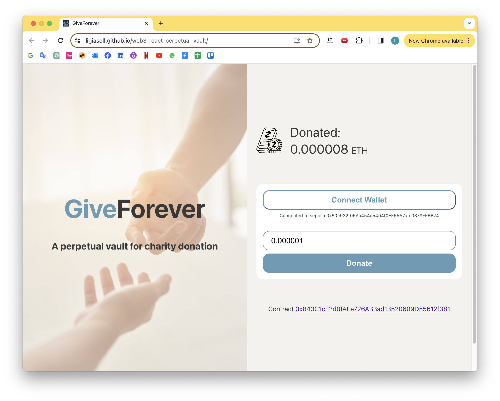
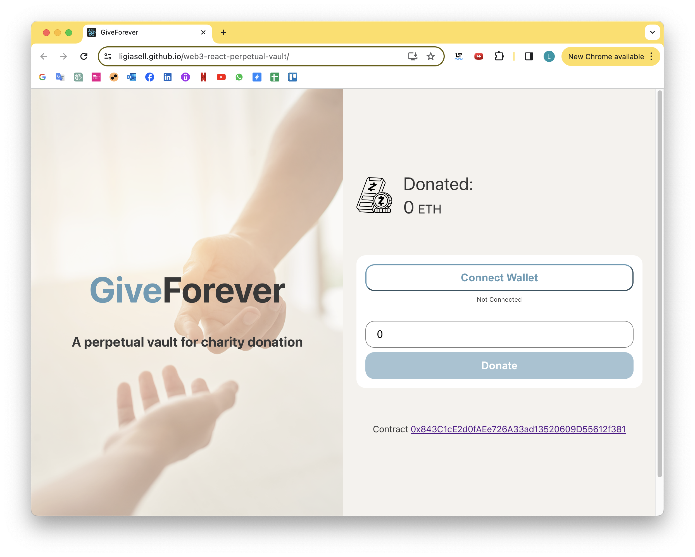

# Web3.0 React Perpetual Vault

A perpetual donation vault using liquid staking tokens

[Check the website!](https://ligiasell.github.io/web3-react-perpetual-vault/)

Technologies: HTML, CSS, Javascript, Solidity, React, Node.js.
Used: Remix IDE, Sepolia Testnet, Metamask Digital Wallet.

Course based: https://www.youtube.com/playlist?list=PLvndXYySeVJ7zKODsgbado7xlr3sYfrU9
[Image background](https://br.freepik.com/fotos-gratis/maos-de-casal-estendidas-entre-si-contra-a-sala-iluminada-pelo-sol_5698762.htm#fromView=search&page=1&position=20&uuid=849ffb78-666b-4f47-b113-fadaee7a1dac)
[Donation logo](https://www.flaticon.com/free-icons/currency-market)

## Run the project

`npm install`
`npm start`

Install Metamask extension on your Browser
